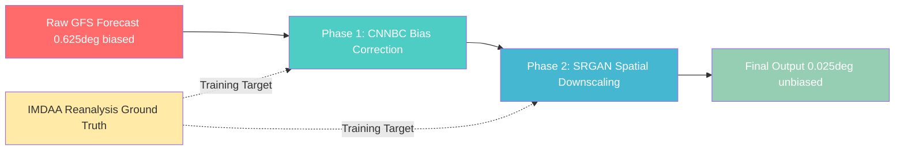
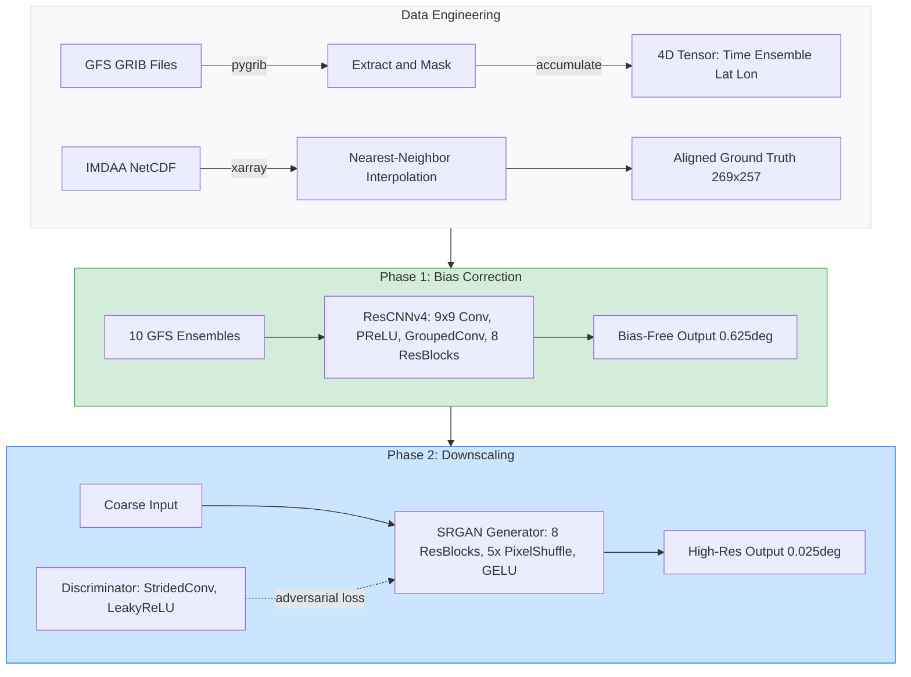
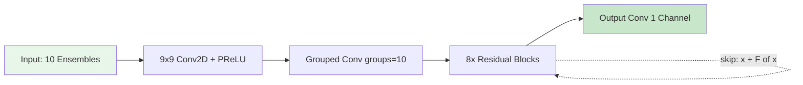
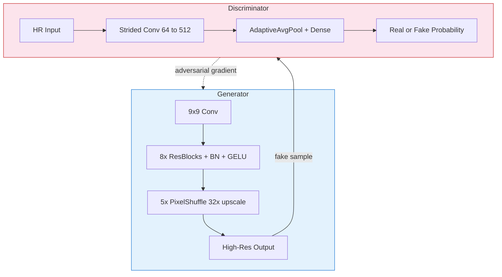
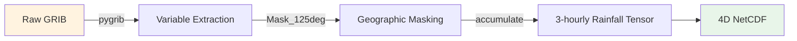
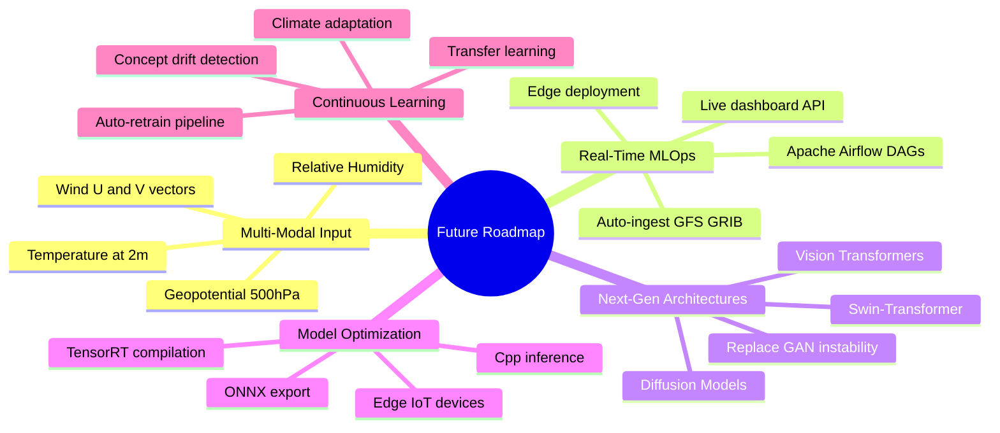

<div align="center">

# 🌧️ Deep Learning-Based Weather Bias Correction & Spatial Downscaling

### *Dual-Phase AI Framework for Precision Precipitation Forecasting over India*

[](https://python.org)
[](https://pytorch.org)
[](https://tensorflow.org)
[](LICENSE)

**IIT Madras (Pune Campus) · M.Tech Thesis · 2025**

---

*Correcting systematic biases in GFS forecasts using 3D Residual CNNs, then enhancing spatial resolution up to **25×** using Super-Resolution GANs — validated against IMDAA reanalysis over the Indian Monsoon (JJAS 2019–2023).*

</div>

---

## 📋 Table of Contents

- [Problem Statement](#-problem-statement)
- [Solution Architecture](#-solution-architecture)
- [Pipeline Overview](#-pipeline-overview)
- [Phase 1 — CNN Bias Correction](#-phase-1--cnn-bias-correction-cnnbc)
- [Phase 2 — SRGAN Spatial Downscaling](#-phase-2--srgan-spatial-downscaling)
- [Dataset Engineering](#-dataset-engineering)
- [Evaluation Metrics](#-evaluation-metrics)
- [Repository Structure](#-repository-structure)
- [Getting Started](#-getting-started)
- [Future Scope](#-future-scope)
- [Author](#-author)

---

## ❓ Problem Statement

The **Global Forecast System (GFS)** is one of the world's most widely used numerical weather prediction models. However, when applied to the **Indian subcontinent** — a region dominated by the Himalayas, extensive coastlines, and the chaotic Indian Monsoon — GFS suffers from two critical limitations:

| Problem | Impact |
|---------|--------|
| **Systematic Bias** | GFS consistently over/under-estimates rainfall due to unresolved sub-grid topography (mountains, valleys). A 70 km grid cannot capture orographic lifting. |
| **Coarse Resolution** | At 0.625°, one pixel covers ~70×70 km. Entire cities fit in a single data point — useless for localized flood prediction or district-level planning. |

> **Goal:** Build an AI post-processing pipeline that takes raw, biased, coarse GFS output and produces **bias-free, hyper-local (0.025°)** precipitation forecasts.

---

## 🏗️ Solution Architecture



---

## 🔄 Pipeline Overview



---

## 🧠 Phase 1 — CNN Bias Correction (CNNBC)

The **ResCNNv4** architecture (`model_4.py`) removes systematic errors from GFS precipitation forecasts.



**Key Design Decisions:**

| Component | Choice | Rationale |
|-----------|--------|-----------|
| Initial Kernel | 9×9 | Captures synoptic-scale (100s of km) weather patterns |
| Activation | PReLU | Learnable negative slope prevents dead neurons during dry periods |
| Groups=10 | Grouped Conv | Independent ensemble processing → implicit regularization |
| Skip Connections | Additive | Preserves baseline weather map topology through 8 deep blocks |
| Optimizer | Adam (lr=1e-8) | Ultra-conservative for late-stage fine-tuning |
| Precision | AMP (FP16) | 2× speed, 0.5× VRAM — critical for multi-GPU training |

---

## 🔬 Phase 2 — SRGAN Spatial Downscaling

After bias correction, the **SRGAN** upscales data from 0.625° → 0.025° (**25× enhancement**).



**Training Strategy:**
1. **Pre-train** Generator on pure MSE loss (learn basic mapping)
2. **Adversarial phase** — Discriminator trained with BCE, Generator with composite loss:
   - `L_total = λ_MSE × L_MSE + λ_adv × L_adversarial`
3. PixelShuffle used instead of Transpose Conv → **zero checkerboard artifacts**

---

## 📊 Dataset Engineering

| Dataset | Role | Resolution | Source |
|---------|------|------------|--------|
| **GFS** | Predictor (input) | 0.625° (~70 km) | NCEP/NOAA |
| **IMDAA** | Ground Truth (target) | 0.125° (~12 km) | IMD-NCMRWF |
| **IMD Gridded** | Validation | 0.25° (~25 km) | IMD |

**Domain:** India (6.5°N–38.5°N, 66.5°E–100.1°E)  
**Period:** JJAS 2019–2023 (Indian Monsoon — peak volatility)



---

## 📈 Evaluation Metrics

| Metric | Formula | Purpose |
|--------|---------|---------|
| **PSNR** | `10 × log₁₀(MAX² / MSE)` | Pixel-level reconstruction quality (>40 dB = exceptional) |
| **MSE** | `Σ(ŷ - y)² / n` | Penalizes large errors exponentially — critical for cloudburst detection |
| **MAE** | `Σ|ŷ - y| / n` | Linear error for seasonal rainfall volume |
| **Pearson r** | `cov(ŷ,y) / (σ_ŷ × σ_y)` | Statistical distribution alignment (target: r → 1.0) |

---

## 📁 Repository Structure

```
├── 📂 Bias_Correction_2025/       # Latest bias correction pipeline
│   ├── model_4.py                 # ResCNNv4 architecture (main)
│   ├── train_cnn.py               # Multi-GPU training script
│   ├── dataset.py                 # Custom PyTorch Dataset
│   ├── config.py                  # Hyperparameters
│   └── robust/                    # Advanced loss functions (SSIM, focal, spectral)
│
├── 📂 CNNBC/                      # Original CNN Bias Correction
│   ├── cnnbc_final.py             # Production model
│   ├── train_cnn.py               # Training loop
│   └── *.pbs                      # HPC job scripts
│
├── 📂 Downscaling/                # SRGAN Spatial Downscaling
│   ├── srgan_pytorch/             # Main SRGAN implementation
│   │   ├── models.py              # Generator + Discriminator
│   │   ├── train_gen.py           # Generator training
│   │   ├── train_disc.py          # Discriminator training
│   │   └── data_loader.py         # Dataset pipeline
│   ├── GFS/                       # GFS-specific downscaling
│   └── vgg/                       # VGG baseline comparison
│
├── 📂 Preprocess_datasets/        # Data engineering scripts
│   ├── Preprocess_GFS_data.py     # GRIB → NetCDF conversion
│   ├── Preprocess_IMDAA.py        # Ground truth alignment
│   ├── Make_Timestamps.py         # Temporal synchronization
│   └── calculate_climatology.py   # Physical upper-bound ceiling
│
├── 📂 bias_correction/            # Legacy bias correction code
├── 📂 pygrib_cfs/                 # GRIB file utilities
├── claude_code.py                 # Automated analysis pipeline
├── .gitignore
└── README.md
```

---

## 🚀 Getting Started

### Prerequisites

```bash
pip install torch torchvision xarray pygrib numpy matplotlib cartopy pandas pillow wandb
```

### Training Bias Correction (CNNBC)

```bash
cd Bias_Correction_2025
python train_cnn.py --config config.py
```

### Training SRGAN Downscaling

```bash
cd Downscaling/srgan_pytorch

# Step 1: Pre-train Generator
python train_gen.py

# Step 2: Train Discriminator
python train_disc.py
```

### HPC (Supercomputer) Submission

```bash
qsub CNNBC/train_cnnbc.pbs
qsub Downscaling/srgan_pytorch/srgan_job1.pbs
```

---

## 🔮 Future Scope



---

## 👤 Author

**Shivanshu Tiwari**  
M.Tech, IIT Madras (Pune Campus)  

---

<div align="center">

*Built with ❤️ for precision meteorology*

**If this work helped your research, please ⭐ this repository.**

</div>
